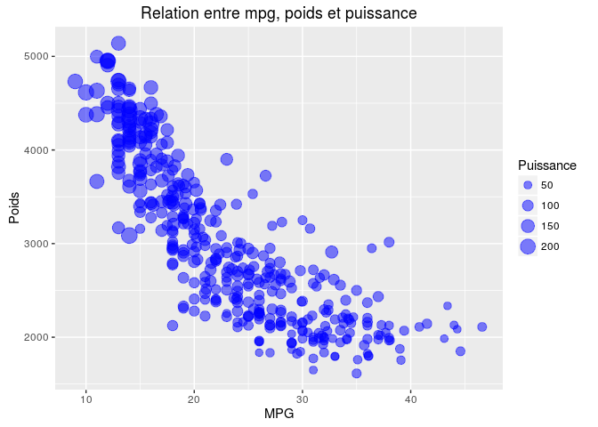
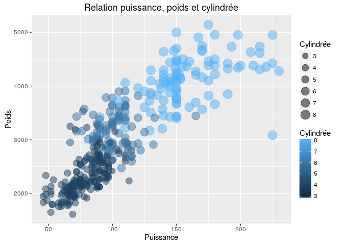
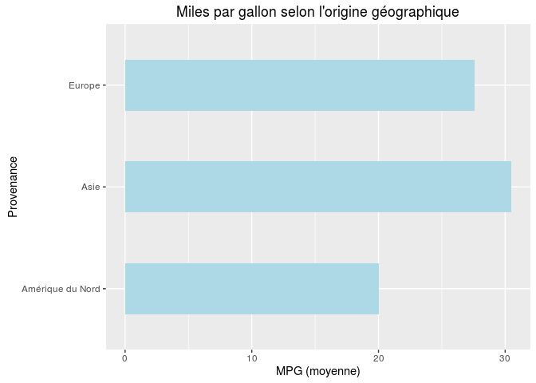
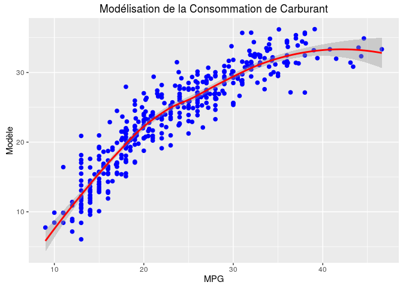

# Auto-MPG_Linear-Regression
FChemin  
September 27, 2016  

Cet article est une synthèse de l'analyse de la consommation de carburant réalisée précédemment sous Excel. Nous utilisons ici le
[langage de programmation R](https://fr.wikipedia.org/wiki/R_(langage_de_programmation_et_environnement_statistique)) et [l'IDE RStudio](https://fr.wikipedia.org/wiki/RStudio).


```r
knitr::opts_chunk$set(echo = TRUE, fig.path = "figure/Auto_MPG-")
library(ggplot2)
library(dplyr)
```

```
## 
## Attaching package: 'dplyr'
```

```
## The following objects are masked from 'package:stats':
## 
##     filter, lag
```

```
## The following objects are masked from 'package:base':
## 
##     intersect, setdiff, setequal, union
```

## Téléchargement et préparation des données


```r
url <- "https://archive.ics.uci.edu/ml/machine-learning-databases/auto-mpg/auto-mpg.data" ## Adresse Internet où se trouve la base de données
download.file(url, destfile = "auto-mpg.data", method = "curl") ## Téléchargement du fichier
df <- read.table(file = "auto-mpg.data", sep = "", dec=".", na.strings = "?") ## Lecture du fichier dans une table
df <- na.omit(df) ## Suppression des lignes avec valeurs manquantes
colnames(df) <- c("mpg", "cylinders", "displacement", "horsepower", "weight", "acceleration", "model.year", "origin", "car name") ## Ajout du nom des colonnes
head(df, 3) ## Aperçu des 3 premières lignes de la table de données
```

```
##   mpg cylinders displacement horsepower weight acceleration model.year
## 1  18         8          307        130   3504         12.0         70
## 2  15         8          350        165   3693         11.5         70
## 3  18         8          318        150   3436         11.0         70
##   origin                  car name
## 1      1 chevrolet chevelle malibu
## 2      1         buick skylark 320
## 3      1        plymouth satellite
```

```r
str(df) ## Présentation de la structure de la table de données
```

```
## 'data.frame':	392 obs. of  9 variables:
##  $ mpg         : num  18 15 18 16 17 15 14 14 14 15 ...
##  $ cylinders   : int  8 8 8 8 8 8 8 8 8 8 ...
##  $ displacement: num  307 350 318 304 302 429 454 440 455 390 ...
##  $ horsepower  : num  130 165 150 150 140 198 220 215 225 190 ...
##  $ weight      : num  3504 3693 3436 3433 3449 ...
##  $ acceleration: num  12 11.5 11 12 10.5 10 9 8.5 10 8.5 ...
##  $ model.year  : int  70 70 70 70 70 70 70 70 70 70 ...
##  $ origin      : int  1 1 1 1 1 1 1 1 1 1 ...
##  $ car name    : Factor w/ 305 levels "amc ambassador brougham",..: 50 37 232 15 162 142 55 224 242 2 ...
##  - attr(*, "na.action")=Class 'omit'  Named int [1:6] 33 127 331 337 355 375
##   .. ..- attr(*, "names")= chr [1:6] "33" "127" "331" "337" ...
```

## Exploration des données


```r
p <- ggplot(df, aes(mpg, weight))
p + geom_point(aes(size=horsepower), colour="blue", alpha=0.5) + ggtitle("Relation entre mpg, poids et puissance") + labs(x="MPG", y="Poids") + scale_size_area(name="Puissance") ## Premier graphique en bulles
```

<!-- -->

```r
p2 <- ggplot(df, aes(horsepower, weight))
p2 + geom_point(aes(size=cylinders, colour=cylinders), alpha=0.5) + ggtitle("Relation puissance, poids et cylindrée") + labs(x="Puissance", y="Poids") + scale_size_area(name="Cylindrée") + scale_color_continuous(name="Cylindrée") ## Second graphique en bulles
```

<!-- -->

```r
mpgperorigin <- summarise(group_by(df, origin), mean=mean(mpg)) ## Moyenne de la consommation selon l'origine du véhicule
mpgperorigin$names <- c("Amérique du Nord", "Europe", "Asie") ## Ajout du nom des zones géographiques
mpgperorigin <- arrange(mpgperorigin, desc(mean)) ## Arrangement par ordre décroissant

p3 <- ggplot(mpgperorigin, aes(names, mean))
p3 + geom_bar(stat="identity", fill="light blue", width=.5) + coord_flip() + ggtitle("Miles par gallon selon l'origine géographique") + labs(x="Provenance", y="MPG (moyenne)") ## Graphique en barres
```

<!-- -->

## Régression linéaire multiple

Nous réalisons une première approche de notre modèle en intégrant toutes les variables indépendantes à notre équation sauf le nom de la voiture:


```r
df.reg <- lm(mpg~. -`car name`, data=df)
summary(df.reg)
```

```
## 
## Call:
## lm(formula = mpg ~ . - `car name`, data = df)
## 
## Residuals:
##     Min      1Q  Median      3Q     Max 
## -9.5903 -2.1565 -0.1169  1.8690 13.0604 
## 
## Coefficients:
##                Estimate Std. Error t value Pr(>|t|)    
## (Intercept)  -17.218435   4.644294  -3.707  0.00024 ***
## cylinders     -0.493376   0.323282  -1.526  0.12780    
## displacement   0.019896   0.007515   2.647  0.00844 ** 
## horsepower    -0.016951   0.013787  -1.230  0.21963    
## weight        -0.006474   0.000652  -9.929  < 2e-16 ***
## acceleration   0.080576   0.098845   0.815  0.41548    
## model.year     0.750773   0.050973  14.729  < 2e-16 ***
## origin         1.426141   0.278136   5.127 4.67e-07 ***
## ---
## Signif. codes:  0 '***' 0.001 '**' 0.01 '*' 0.05 '.' 0.1 ' ' 1
## 
## Residual standard error: 3.328 on 384 degrees of freedom
## Multiple R-squared:  0.8215,	Adjusted R-squared:  0.8182 
## F-statistic: 252.4 on 7 and 384 DF,  p-value: < 2.2e-16
```

La valeur R<sup>2</sup> est égale ici à **0.82**. Nous remarquons aussi que la relation entre la variable *mpg* et les variables *cylinders*, *horsepower* et *acceleration* est non-significative à 95% car **la valeur p de leurs coefficient est supérieure à 0,05**.

Nous supprimons ces variables de notre équation et effectuons une nouvelle régression linéaire:


```r
df.reg2 <- lm(mpg ~ displacement + weight + model.year + origin, data = df)
summary(df.reg2)
```

```
## 
## Call:
## lm(formula = mpg ~ displacement + weight + model.year + origin, 
##     data = df)
## 
## Residuals:
##     Min      1Q  Median      3Q     Max 
## -9.8102 -2.1129 -0.0388  1.7725 13.2085 
## 
## Coefficients:
##                Estimate Std. Error t value Pr(>|t|)    
## (Intercept)  -1.861e+01  4.028e+00  -4.620 5.25e-06 ***
## displacement  5.588e-03  4.768e-03   1.172    0.242    
## weight       -6.575e-03  5.571e-04 -11.802  < 2e-16 ***
## model.year    7.714e-01  4.981e-02  15.486  < 2e-16 ***
## origin        1.226e+00  2.670e-01   4.593 5.92e-06 ***
## ---
## Signif. codes:  0 '***' 0.001 '**' 0.01 '*' 0.05 '.' 0.1 ' ' 1
## 
## Residual standard error: 3.346 on 387 degrees of freedom
## Multiple R-squared:  0.8181,	Adjusted R-squared:  0.8162 
## F-statistic: 435.1 on 4 and 387 DF,  p-value: < 2.2e-16
```

La valeur R<sup>2</sup> est ici aussi égale à **0.82**. Nous observons par contre que la variable *displacement* est moins significative dans cette version de notre équation.

Continuons encore un peu avec une troisième version:


```r
df.reg3 <- lm(mpg ~ weight + model.year + origin, data = df)
summary(df.reg3)
```

```
## 
## Call:
## lm(formula = mpg ~ weight + model.year + origin, data = df)
## 
## Residuals:
##     Min      1Q  Median      3Q     Max 
## -9.9440 -2.0948 -0.0389  1.7255 13.2722 
## 
## Coefficients:
##               Estimate Std. Error t value Pr(>|t|)    
## (Intercept) -1.805e+01  4.001e+00  -4.510 8.60e-06 ***
## weight      -5.994e-03  2.541e-04 -23.588  < 2e-16 ***
## model.year   7.571e-01  4.832e-02  15.668  < 2e-16 ***
## origin       1.150e+00  2.591e-01   4.439 1.18e-05 ***
## ---
## Signif. codes:  0 '***' 0.001 '**' 0.01 '*' 0.05 '.' 0.1 ' ' 1
## 
## Residual standard error: 3.348 on 388 degrees of freedom
## Multiple R-squared:  0.8175,	Adjusted R-squared:  0.816 
## F-statistic: 579.2 on 3 and 388 DF,  p-value: < 2.2e-16
```

Cette fois-ci, tous les coefficients ont une **valeur p faible**. L'équation finale de notre modèle peut s'écrire comme suit:

> "mpg = -18.05 - 0.005994 * weight - 0.7571 * model year + 1.15 * origin

## Simulation avec de nouvelles données


```r
model <- df.reg3
new.df <- data.frame(weight = 2843, origin = 1, model.year = 70) ## Création d'une nouvelle table de données
predict(model, new.df, interval = "confidence") ## Prévision de la consommation à l'aide de notre modèle
```

```
##        fit      lwr      upr
## 1 19.06209 18.31006 19.81413
```

Le résultat obtenu ici signifie que pour les valeurs de poids, d'origine et d'année du modèle, la consommation sera comprise entre 18.3 et 19.8 avec une probabilité de 95%.

Notre intuition concernant l'influence du **poids** sur la consommation du véhicule était donc fondée et nous avons également découvert l'importance de l'**année de fabrication** et de l'**origine** du modèle sur sa consommation.

## Création d'un graphique final


```r
df$model <- predict(model, newdata = df, interval = "confidence")

g <- ggplot(df)
g <- g + geom_point(aes(x=mpg, y=model[,1]), size=2, colour="blue")
g <- g + geom_smooth(data=df, aes(x=mpg, y=model[,1], ymin=model[,2], ymax=model[,3]), size=1, colour="red", stat="smooth")
g <- g + labs(title = "Modélisation de la Consommation de Carburant", x = "MPG", y="Modèle")
g
```

<!-- -->

## Sources

> Lichman, M. (2013). UCI Machine Learning Repository (http://archive.ics.uci.edu/ml).

> Irvine, CA: University of California, School of Information and Computer Science.
